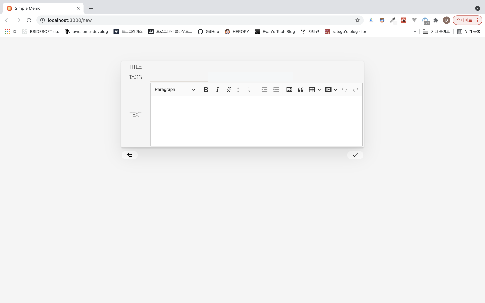
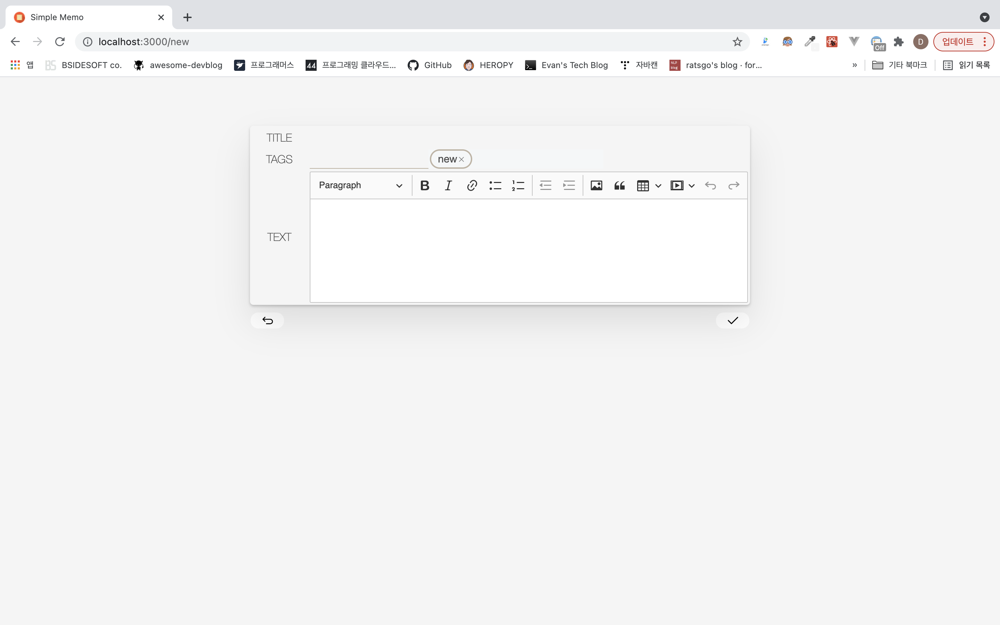

# Simple Memo App

## Setup

아래의 명령어로 레포지토리 클론 및 라이브러리 설치가 가능하다:

```
git clone https://github.com/psy082/SimpleMemo.git
cd SimpleMemo
yarn install
```

설치 후에 Simple Memo App을 develop 환경에서 빌드 및 실행하기 위해서 아래의 명령어를 사용한다.

```
yarn start
```

## 메모 생성 시 가이드

<div style="display: flex">
  
  
</div>

메모에서 tag 생성 시 input에 tag 입력 후 ;(semicolon)을 입력해야 tag로 생성이 된다.생성된 tag를 지우고 싶다면 태그 뱃지에 있는 x를 클릭하면 해당 tag가 삭제된다.

## Page Requirements

### 메모 목록 화면

- [x] 메모 목록에 번호/제목/태그 표시\*

- [x] 메모 생성 버튼. 버튼 클릭 시 메모 만들기 기능을 실행할 수 있는 에디터 화면으로 이동\*

- [x] 해당 목록에 있는 메모 중 하나 클릭 시 메모 상세 보여주기 화면으로 이동\*

- [x] 메모에 있는 모든 태그를 나열하는 태그 바 표시

- [ ] 메모 검색 바, 검색 바에 키워드 입력시, 메모의 제목이 키워드를 포함하는 메모를 필터링하여 표시

- [ ] 태그 클릭 시 해당 태그의 메모들만 필터링하여 표시

- [ ] 페이지네이션을 위한 컴포넌트와 페이징 기능

### 메모 상세 화면

- [x] 개별 메모의 번호/제목/태그/내용 표시\*

- [x] 수정 버튼. 버튼 클릭 시 메모 수정 기능을 실행할 수 있는 에디터 화면으로 이동\*

- [x] 삭제 버튼. 버튼 클릭 시 메모 삭제 기능을 실행할 수 있는 에디터 화면으로 이동\*

### 에디터 화면

- [x] 메모의 제목/태그/내용 수정 가능\*

- [x] 취소 버튼. 버튼 클릭 시 이전 화면으로 돌아가기\*

- [x] 확인 버튼. 버튼 클릭시 화면에 들어올 때 요청했던 메모 만들기/수정하기/삭제하기 중 하나의 동작을 수행\*

- [x] WYSIWYG 에디터 적용

\*표시는 필수 구현 기능
